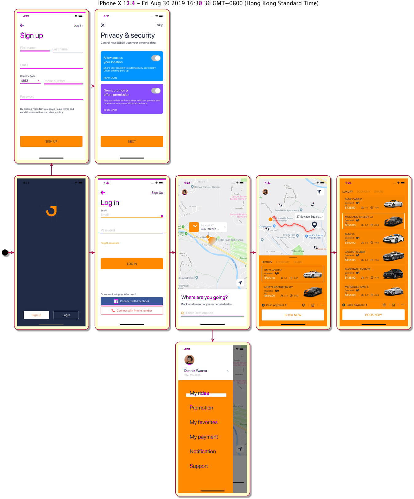

iOS upgrade always break our app and we only can do eyeball checking to verify UI display, i write this demo to explain how to make it easy.

### Components

1. `webdriverio` - part of appium, automate mobile test & cap screen
2. `plantuml` - draw diagram
3. `looks-same` - compare image

### Concept

1. Execute mobile automation test on existing iOS version & new iOS version using `webdriverio` 
2. Compare each screen diff using `looks-same`
3. finally draw the diff image with diagram & navigation flow with `plantuml` 

### Sample Output

### App & Resources

origin source clone from [https://github.com/appium/appium/tree/master/sample-code](https://github.com/appium/appium/tree/master/sample-code)

demo app : [https://www.sketchappsources.com/free-source/4087-car-rental-app-ui-kit-sketch-freebie-resource.html](https://www.sketchappsources.com/free-source/4087-car-rental-app-ui-kit-sketch-freebie-resource.html)

### How to run

1. change app path in juber.test.js
2. run `npm install` at the project path, plantuml require external package which you need to install manually, please read the npm install log
3. open simulator iPhone X 11.4 & 12.1
4. run `npm test` , it will generate screen image after test, when all test case completed, it will generate all screen and screen chart
